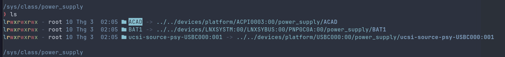

# Set Hybrid Gpu sync for linux

#My Computer
Model: ASUS TUF Gaming F15 FX506LHB_FX506LHB
CPU: Intel(R) Core(TM) i5-10300H
dGpu:NVIDIA GeForce GTX 1650 Mobile / Max-Q

#Auto installation

```bash
git clone https://github.com/sonbontuoi/set-hybrid-gpu-sync-for-linux.git
cd ./set-hybrid-gpu-sync-for-linux
chmod +x ./install.sh
./install.sh
```

#Manual installation

Clone the repository

```bash
git clone https://github.com/sonbontuoi/set-hybrid-gpu-sync-for-linux.git
cd ./set-hybrid-gpu-sync-for-linux
```

Setup script switch gpu and setup environment for nvidia

```bash
mkdir -p ~/.scripts
cp ./config/scripts/gpu-autocheck.sh ~/.scripts
chmod +x ~/.scripts/gpu-autocheck.sh
mkdir -p ~/.config/environment.d
cp ./config/environment.d/99-nvidia.conf ~/.config/environment.d
```

Check your AC adapter name:

```bash
ls /sys/class/power_supply
```



Update the STATUS variable in the script to match your output:

```bash
nano ~/.scripts/gpu-autocheck.sh
```

Setup rule udev

```bash
sudo cp ./config/rules/99-gpu-power.rules /etc/udev/rules.d
```

Setup service run at start computer

```bash
sudo cp ./config/services/gpu-check-boot.service /etc/systemd/system/
sudo systemctl enable --now gpu-check-boot.service
```

Reload or Sign out.
